# E-commerce Data Pipeline Architecture

```mermaid
graph TB
    %% Data Input
    CSV["📄 CSV Files<br/>E-commerce Data"] --> S3_DATA["🗄️ S3 Data Bucket<br/>ecommerce-data-pipeline"]

    %% Real-time Processing Path
    S3_DATA --> |"S3 Event<br/>Object Created"| LAMBDA_TRIGGER["⚡ Lambda Function<br/>TriggerGlueJob"]

    %% Scheduled Processing Path
    EVENTBRIDGE["⏰ EventBridge<br/>Daily at 2:00 AM UTC"] --> LAMBDA_SCHEDULED["⚡ Lambda Function<br/>ScheduledBatchProcessor"]
    LAMBDA_SCHEDULED --> |"List & Process<br/>CSV Files"| S3_DATA

    %% Alternative Direct Scheduling (Disabled by default)
    EVENTBRIDGE_DIRECT["⏰ EventBridge<br/>Direct Glue Trigger<br/>2:30 AM UTC<br/>Disabled"] -.-> |"Alternative Path"| LAMBDA_PROCESS_ALL["⚡ Lambda Function<br/>ProcessAllFiles"]
    LAMBDA_PROCESS_ALL -.-> S3_DATA

    %% Glue Job Processing
    LAMBDA_TRIGGER --> |StartJobRun| GLUE_JOB["🔧 AWS Glue Job<br/>DataProcessingJob<br/>Python ETL"]
    LAMBDA_SCHEDULED --> |StartJobRun| GLUE_JOB
    LAMBDA_PROCESS_ALL -.-> |StartJobRun| GLUE_JOB

    %% Glue Job Components
    S3_SCRIPTS["🗄️ S3 Scripts Bucket<br/>ecommerce-glue-scripts"] --> |"Script Location"| GLUE_JOB

    %% Data Processing within Glue Job
    GLUE_JOB --> |"Read CSV Data"| SPARK["⚙️ Apache Spark<br/>Data Processing"]
    SPARK --> |"Extract Text Content"| TEXT_PROCESSING["📝 Text Content Creation<br/>Product + Description + Features"]
    TEXT_PROCESSING --> |"Generate Embeddings"| BEDROCK["🤖 Amazon Bedrock<br/>Titan Embed Text v1<br/>1536-dimensional vectors"]

    %% Output Storage
    BEDROCK --> |"Vector Embeddings"| VECTOR_STORE["🗄️ S3 JSON Storage<br/>processed-data/date/embeddings"]

    %% Future Vector Database (Placeholder)
    VECTOR_STORE -.-> |"Future Migration"| VECTOR_DB["🔍 Vector Database<br/>OpenSearch/Pinecone/Weaviate"]

    %% IAM Roles and Permissions
    GLUE_ROLE["🔐 IAM Role<br/>GlueJobRole"] --> |Permissions| GLUE_JOB
    GLUE_ROLE --> |ReadWrite| S3_DATA
    GLUE_ROLE --> |Read| S3_SCRIPTS
    GLUE_ROLE --> |InvokeModel| BEDROCK

    %% Monitoring and Logs
    GLUE_JOB --> |"Job Logs"| CLOUDWATCH["📊 CloudWatch Logs<br/>Monitoring & Debugging"]
    LAMBDA_TRIGGER --> CLOUDWATCH
    LAMBDA_SCHEDULED --> CLOUDWATCH

    %% Styling
    classDef s3Bucket fill:#FF9900,stroke:#333,stroke-width:2px,color:white
    classDef lambda fill:#FF9900,stroke:#333,stroke-width:2px,color:white
    classDef glue fill:#8C4FFF,stroke:#333,stroke-width:2px,color:white
    classDef bedrock fill:#FF6B6B,stroke:#333,stroke-width:2px,color:white
    classDef eventbridge fill:#4ECDC4,stroke:#333,stroke-width:2px,color:white
    classDef iam fill:#FFE66D,stroke:#333,stroke-width:2px,color:black
    classDef monitoring fill:#95E1D3,stroke:#333,stroke-width:2px,color:black
    classDef processing fill:#A8E6CF,stroke:#333,stroke-width:2px,color:black
    classDef future fill:#FFB3BA,stroke:#333,stroke-width:2px,color:black,stroke-dasharray: 5 5

    class S3_DATA,S3_SCRIPTS,VECTOR_STORE s3Bucket
    class LAMBDA_TRIGGER,LAMBDA_SCHEDULED,LAMBDA_PROCESS_ALL lambda
    class GLUE_JOB glue
    class BEDROCK bedrock
    class EVENTBRIDGE,EVENTBRIDGE_DIRECT eventbridge
    class GLUE_ROLE iam
    class CLOUDWATCH monitoring
    class SPARK,TEXT_PROCESSING processing
    class VECTOR_DB future
```

## Architecture Components

### 1. **Data Ingestion Layer**
- **S3 Data Bucket**: Stores incoming CSV files with e-commerce product data
- **Event-driven Processing**: S3 object creation events trigger immediate processing
- **Scheduled Processing**: Daily batch processing at 2:00 AM UTC

### 2. **Orchestration Layer**
- **Lambda Functions**:
  - `TriggerGlueJob`: Real-time trigger for individual CSV uploads
  - `ScheduledBatchProcessor`: Daily batch processing coordinator
  - `ProcessAllFiles`: Alternative direct processing (disabled by default)
- **EventBridge**: Cron-based scheduling for automated daily runs

### 3. **Processing Layer**
- **AWS Glue Job**: Python ETL job using Apache Spark
  - Reads CSV data from S3
  - Processes and cleans product information
  - Creates optimized text content for embeddings
  - Generates vector embeddings via Bedrock
  - Saves processed data back to S3

### 4. **AI/ML Layer**
- **Amazon Bedrock**: Uses Titan Embed Text v1 model
  - Generates 1536-dimensional vector embeddings
  - Processes product descriptions, features, and metadata
  - Optimized for e-commerce semantic search

### 5. **Storage Layer**
- **Current**: JSON files in S3 with embeddings and metadata
- **Future**: Dedicated vector database (OpenSearch, Pinecone, etc.)

### 6. **Security & Monitoring**
- **IAM Roles**: Least privilege access for all components
- **CloudWatch**: Centralized logging and monitoring
- **S3 Bucket Policies**: Secure data access controls

## Data Flow

1. **CSV Upload** → S3 Data Bucket
2. **S3 Event** → Lambda Trigger Function
3. **Lambda** → Starts Glue Job with file parameters
4. **Glue Job** → Reads CSV, processes data using Spark
5. **Text Processing** → Creates semantic-rich content strings
6. **Bedrock API** → Generates vector embeddings
7. **Output Storage** → Saves processed data with embeddings to S3
8. **Monitoring** → All activities logged to CloudWatch

## Key Features

- **Dual Processing Modes**: Real-time (event-driven) and scheduled (batch)
- **Scalable Processing**: Apache Spark handles large datasets
- **AI-Powered**: Vector embeddings for semantic search capabilities
- **Cost-Optimized**: Serverless architecture with pay-per-use model
- **Secure**: Comprehensive IAM roles and S3 bucket policies
- **Extensible**: Easy integration with vector databases